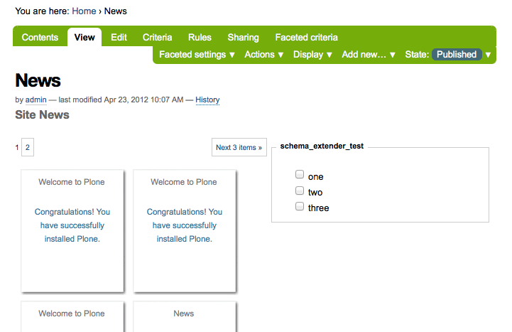

Simple example
==============

*From the archetypes.schemaextender README*

As an example we will add a simple boolean field to the standard
Plone document type. First we need to create a field class::

     from Products.Archetypes.public import BooleanField
     from archetypes.schemaextender.field import ExtensionField

     class MyBooleanField(ExtensionField, BooleanField):
         """A trivial field."""

schemaextender can not use the standard Archetypes fields directly
since those rely on the class generation logic generating accessors
and mutator methods. By using the ExtensionField mix-in class we can
still use them. Make sure the ExtensionField mix-in comes first, so it
properly overwrites the standard methods.

Next we have to create an adapter that will add this field::

    from zope.component import adapts
    from zope.interface import implements
    from archetypes.schemaextender.interfaces import ISchemaExtender
    from Products.Archetypes.public import BooleanWidget
    from Products.ATContentTypes.interface import IATDocument

    class PageExtender(object):
        adapts(IATDocument)
        implements(ISchemaExtender)

        fields = [
            MyBooleanField("super_power",
            widget = BooleanWidget(
                label="This page has super powers")),
                ]

        def __init__(self, context):
            self.context = context

        def getFields(self):
            return self.fields

Try to store the fields on the class, that way they aren't created each
time the getFields method gets called. Generally you should make sure
getFields does as few things as possible, because it's called very often.

The final step is registering this adapter with the Zope component
architecture. Since we already declared the interface we provide and
which type of object we adapt this can be done very quickly in
configure.zcml (assuming you put the code above in a file extender.py)::

    <configure xmlns="http://namespaces.zope.org/zope"
               xmlns:five="http://namespaces.zope.org/five">

        <include package="archetypes.schemaextender" />
        <adapter factory=".extender.PageExtender" />
    </configure>

